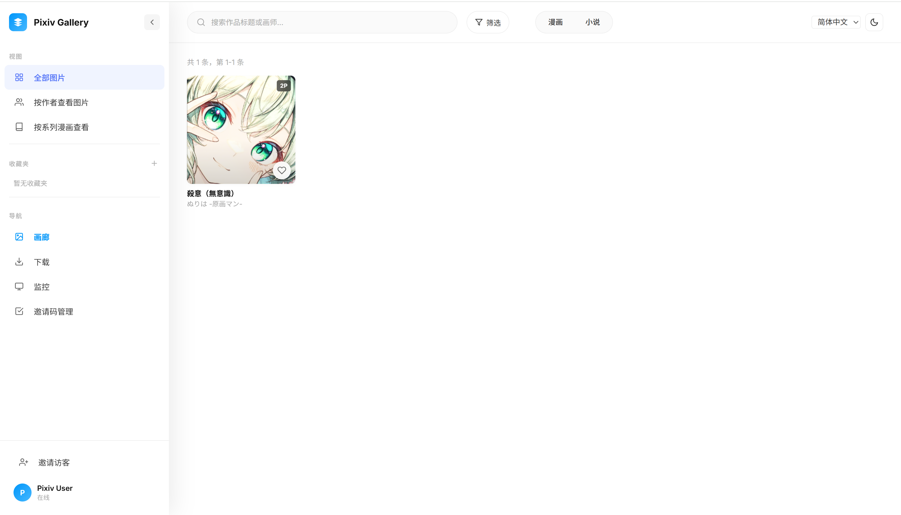
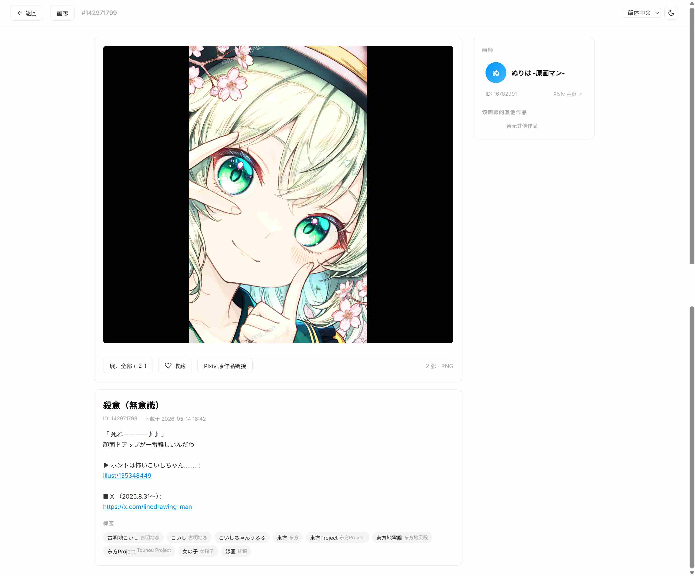
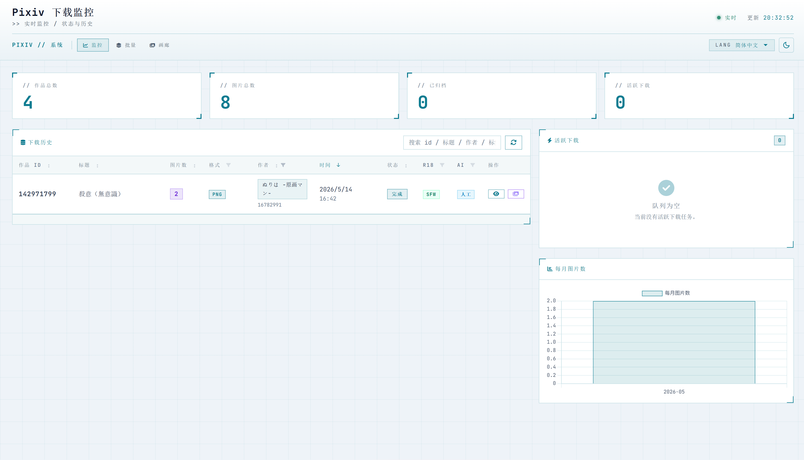
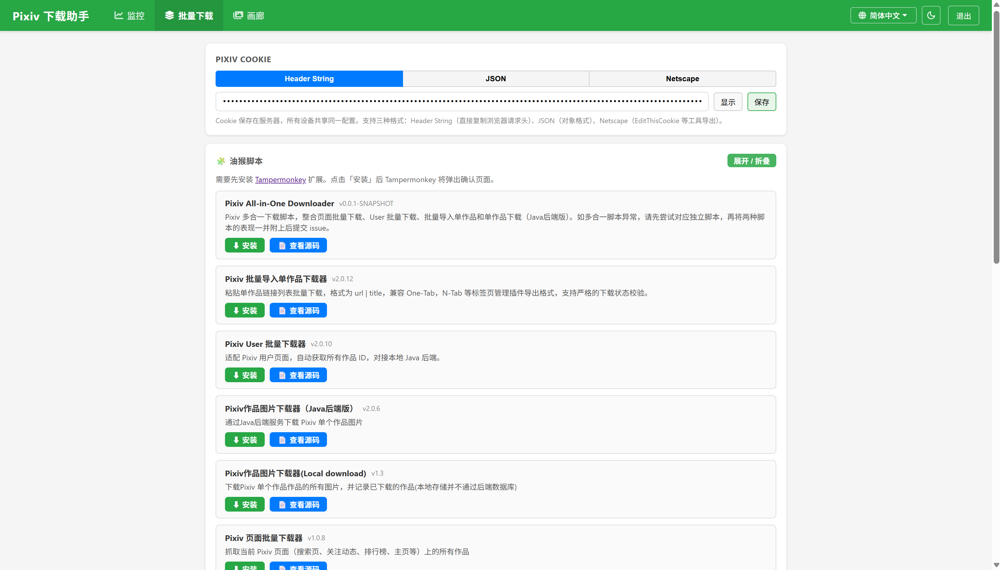
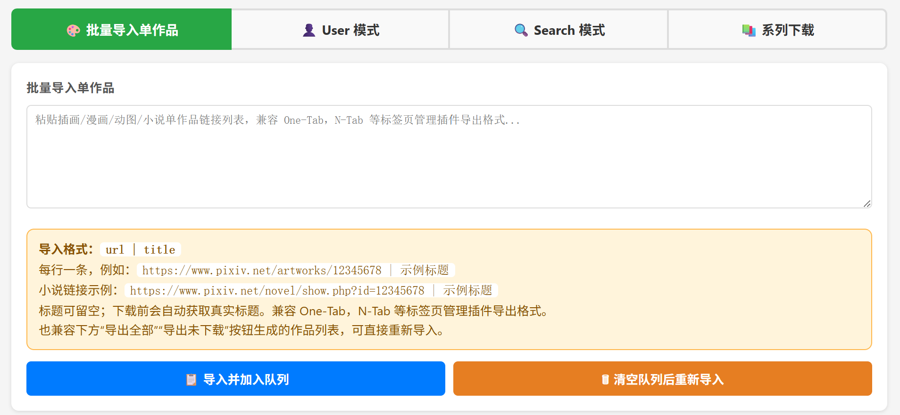
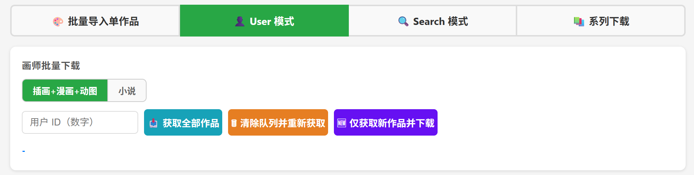
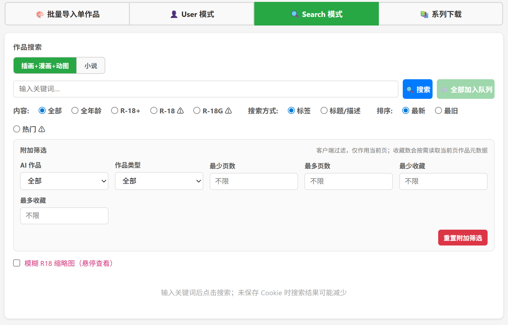
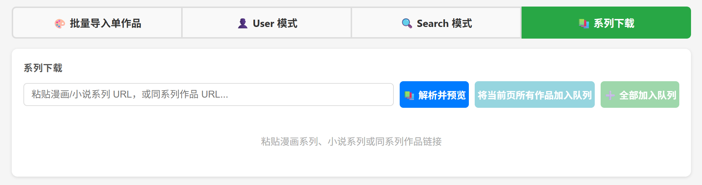
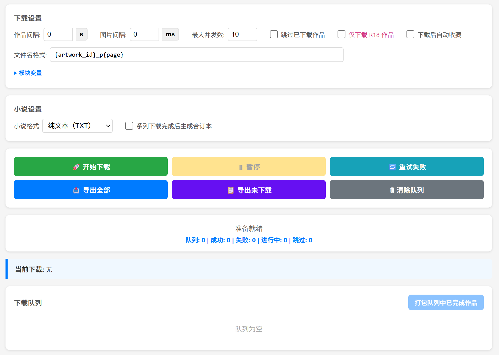

#### pixiv-gallery.html gallery screenshot

#### pixiv-artwork.html work details page screenshot

#### monitor.html screenshot

#### pixiv-batch.html userscript installation page screenshot

#### pixiv-batch.html bulk import single works page screenshot (the userscript offers the same capability, but the web page is more convenient)

#### pixiv-batch.html User mode screenshot (the userscript offers the same capability, but the web page is more convenient)

#### pixiv-batch.html Search mode screenshot

#### pixiv-batch.html series download screenshot

#### pixiv-batch.html download settings, queue, and other common sections

#### Pixiv page batch downloader userscript screenshot, supports Pixiv-wide scraping

#### Single-work userscript download screenshot (Java backend mode and Local download mode provide the same result)

