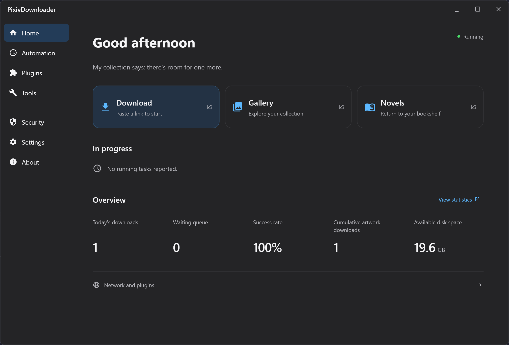
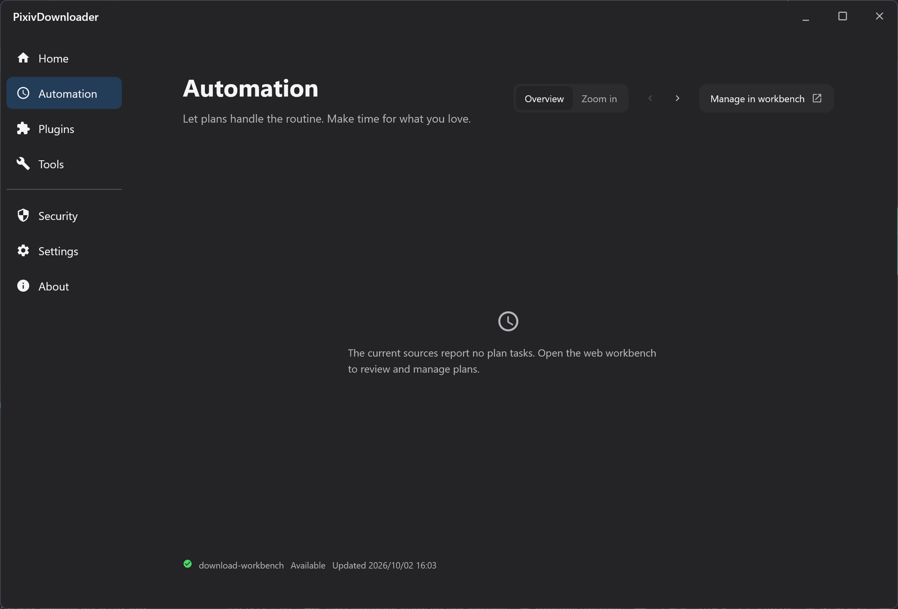
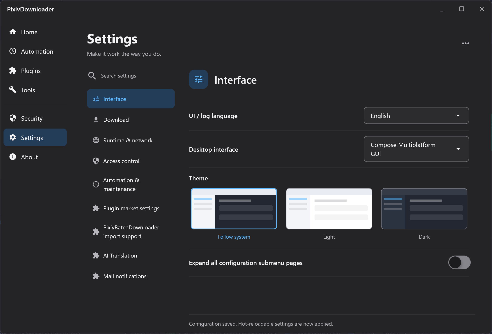
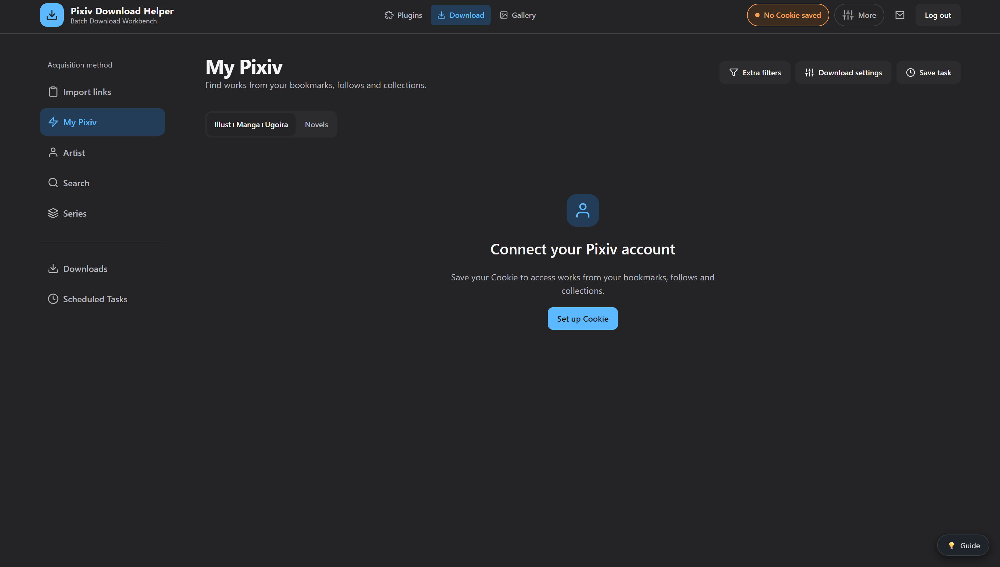
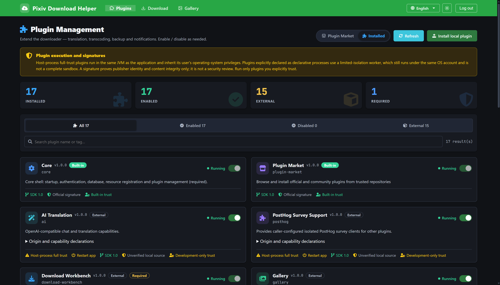
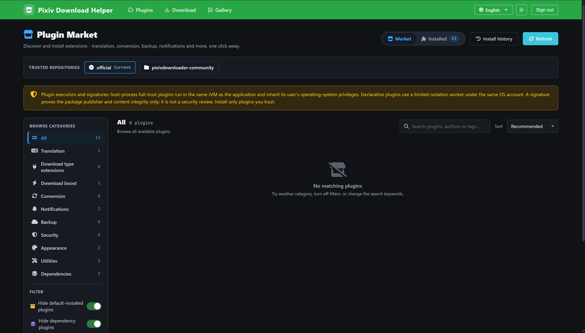
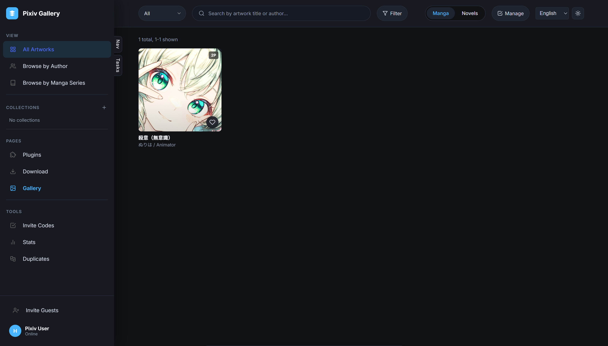
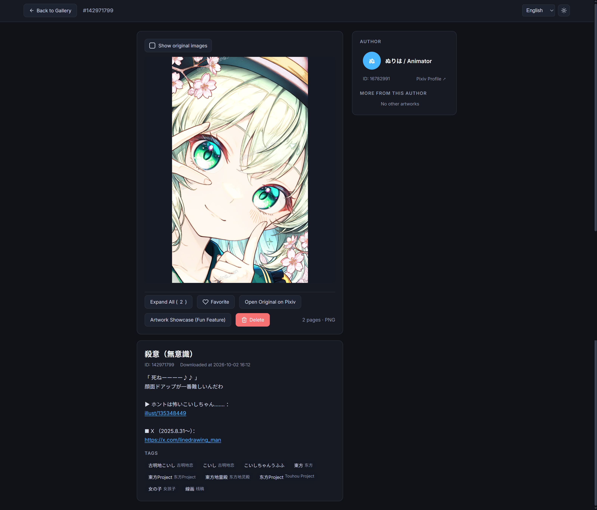
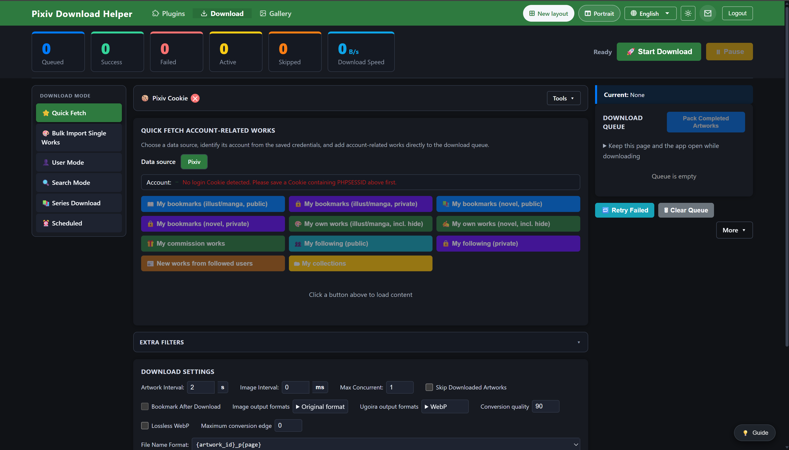

# Dark mode screenshots

The application supports English. The application screenshots below use English; the two userscript screenshots use Simplified Chinese.

## Compose desktop interface

### Home

### Automation

### Settings

## Download workbench and plugins

### Download workbench: My Pixiv (pixiv-batch-alt.html)

### Plugin management

### Plugin market

The active filters leave no matching plugins in this screenshot.

## Gallery

### Gallery (pixiv-gallery.html)

### Artwork details (pixiv-artwork.html)

## Classic download layout (pixiv-batch.html)

## Userscripts

These two screenshots show the userscripts on Pixiv in Simplified Chinese and light mode.

Show userscript screenshots in light mode

### Pixiv page batch downloader (Page Scrape)

Supports Pixiv-wide scraping.

### Single-work downloader (Java backend and Local download)

The Java backend and Local download versions provide the same download result.

