# ライトモードのスクリーンショット

アプリは日本語表示に対応しています。アプリのスクリーンショットは英語、ユーザースクリプトのスクリーンショットは簡体字中国語です。

## Compose デスクトップ画面

### ホーム

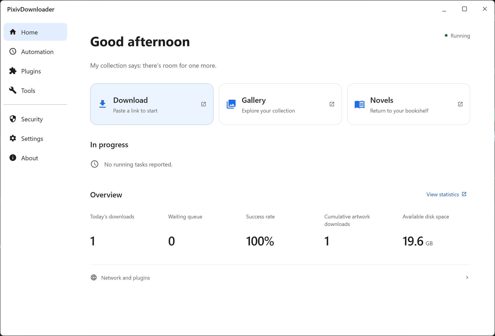

### 自動化

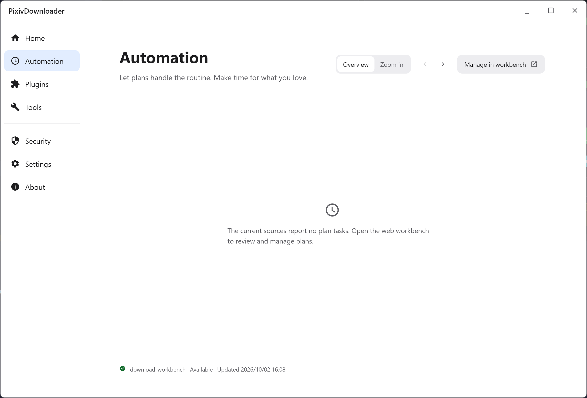

### 設定

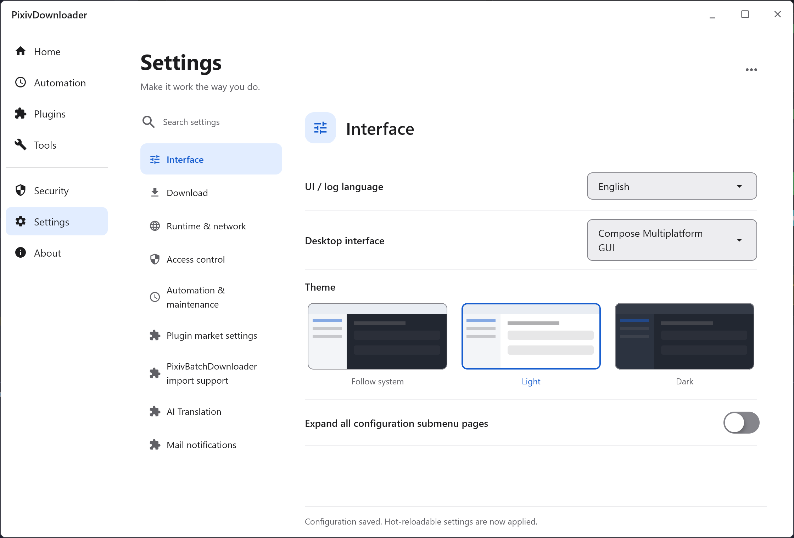

## ダウンロード画面とプラグイン

### ダウンロード画面：My Pixiv（pixiv-batch-alt.html）

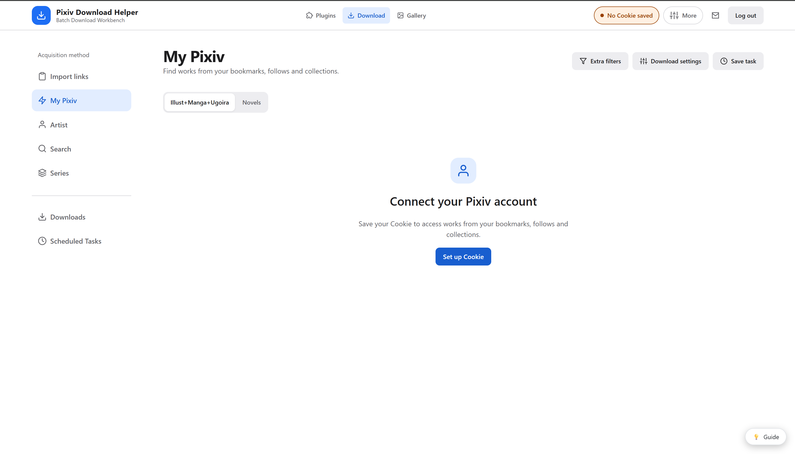

### プラグイン管理

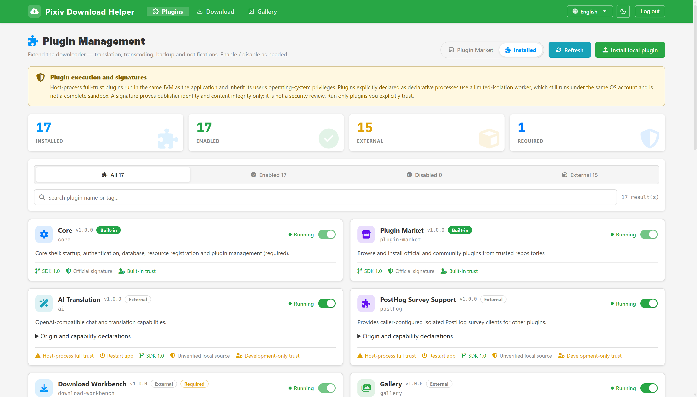

### プラグインマーケット

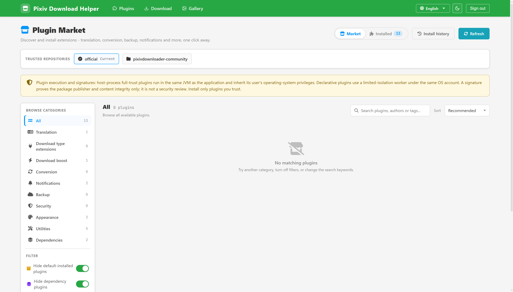

この画面ではフィルターが有効になっており、条件に一致するプラグインはありません。

## ギャラリー

### ギャラリー（pixiv-gallery.html）

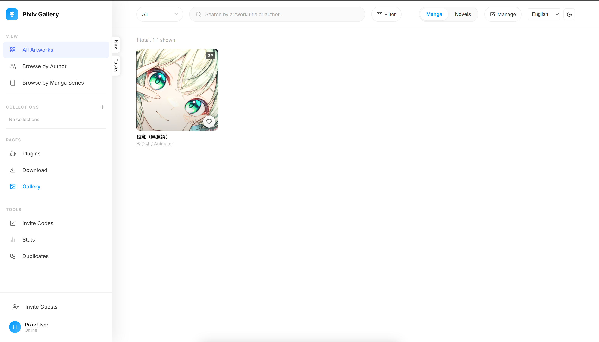

### 作品詳細（pixiv-artwork.html）

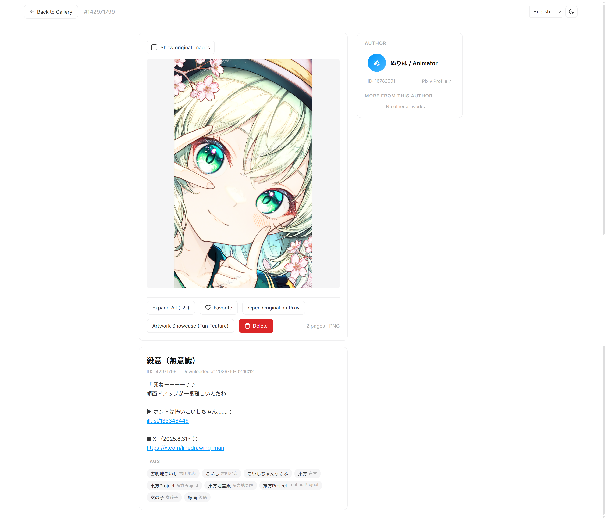

## 従来のダウンロード画面（pixiv-batch.html）

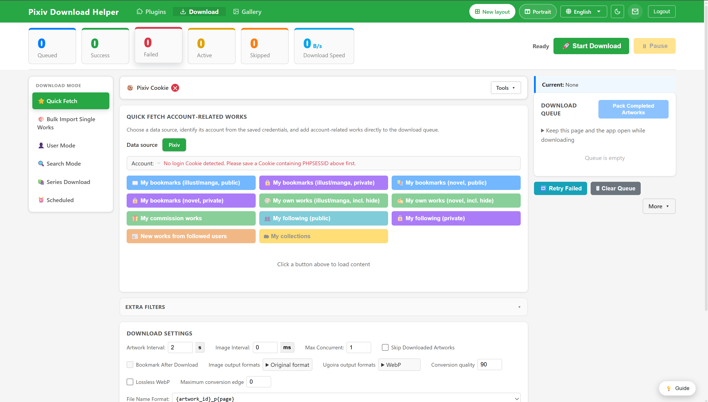

## ユーザースクリプト

以下の2枚は、Pixiv 上で動作するユーザースクリプトの画面です。簡体字中国語のライトモードで表示されています。

### Pixiv ページ一括ダウンローダー（Page Scrape）

Pixiv 全体のページから作品を取得できます。

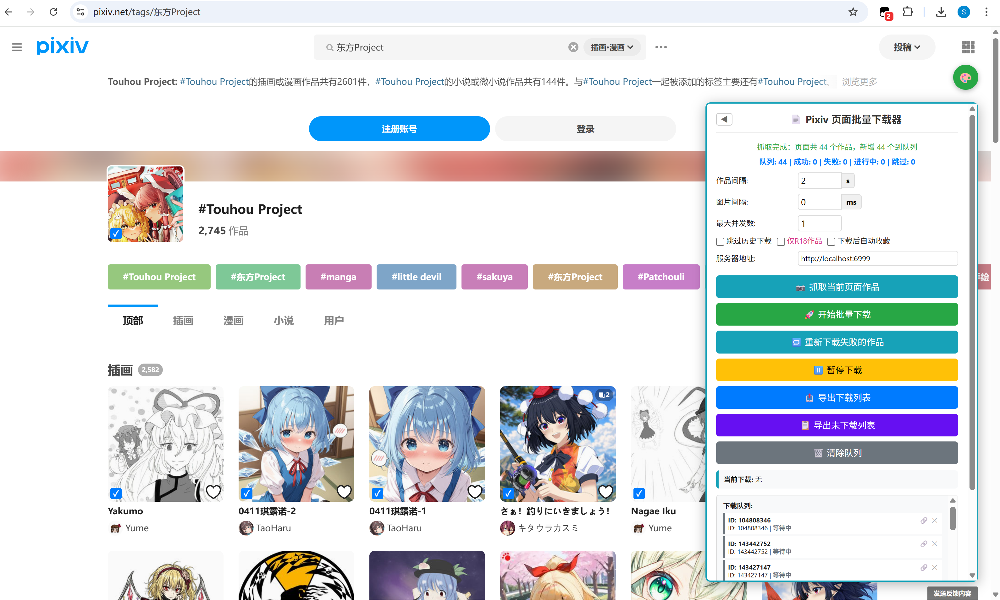

### 単一作品ダウンローダー（Java バックエンドと Local download）

Java バックエンド版と Local download 版のダウンロード結果は同じです。

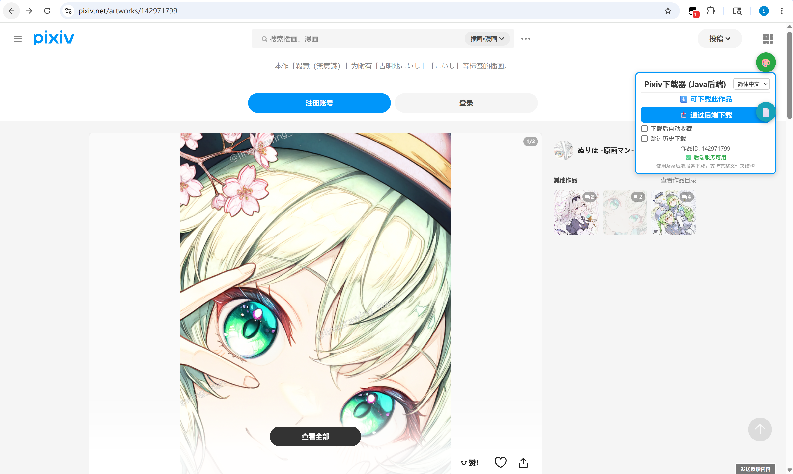
