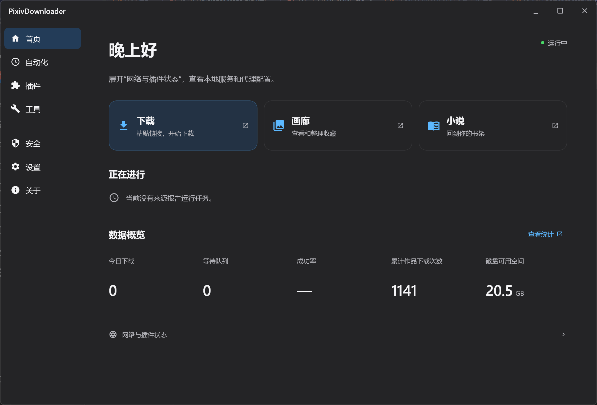
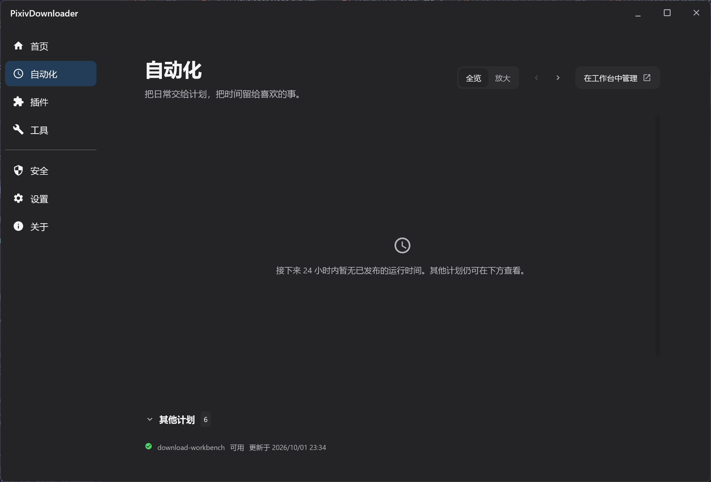
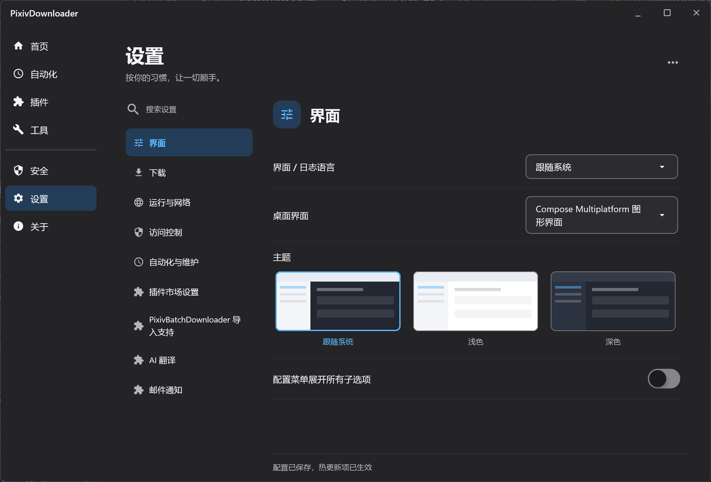
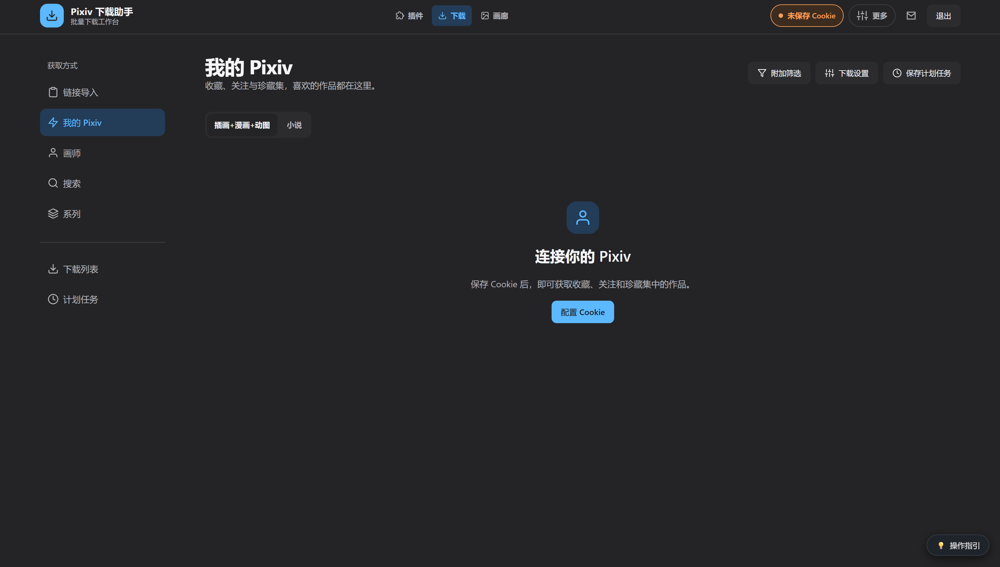
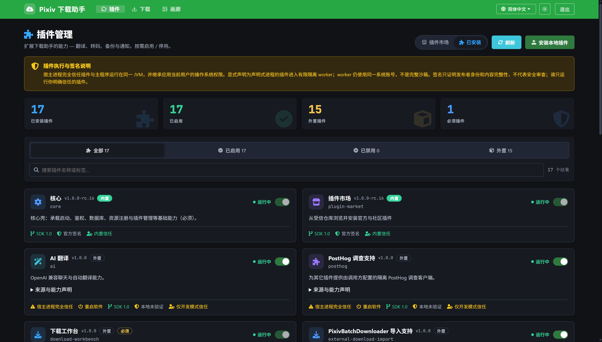
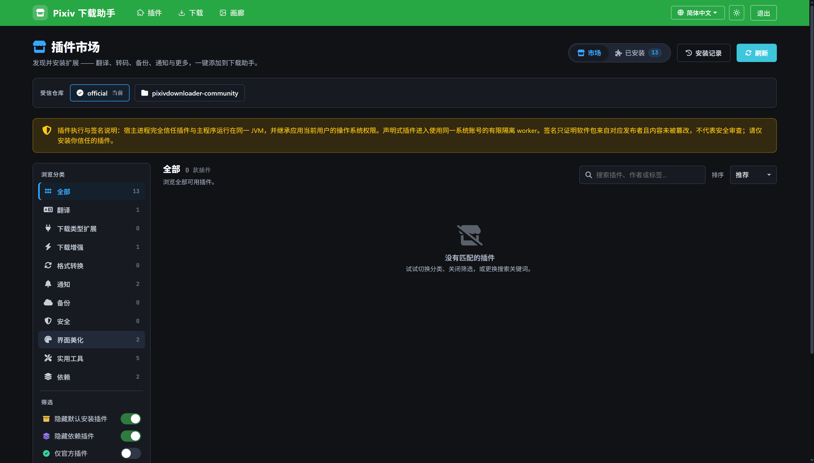
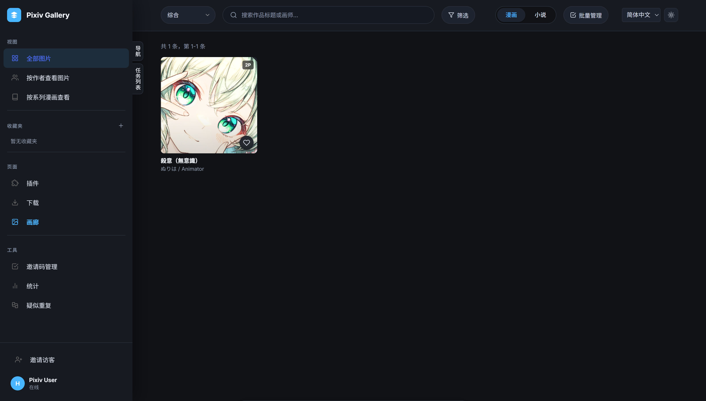
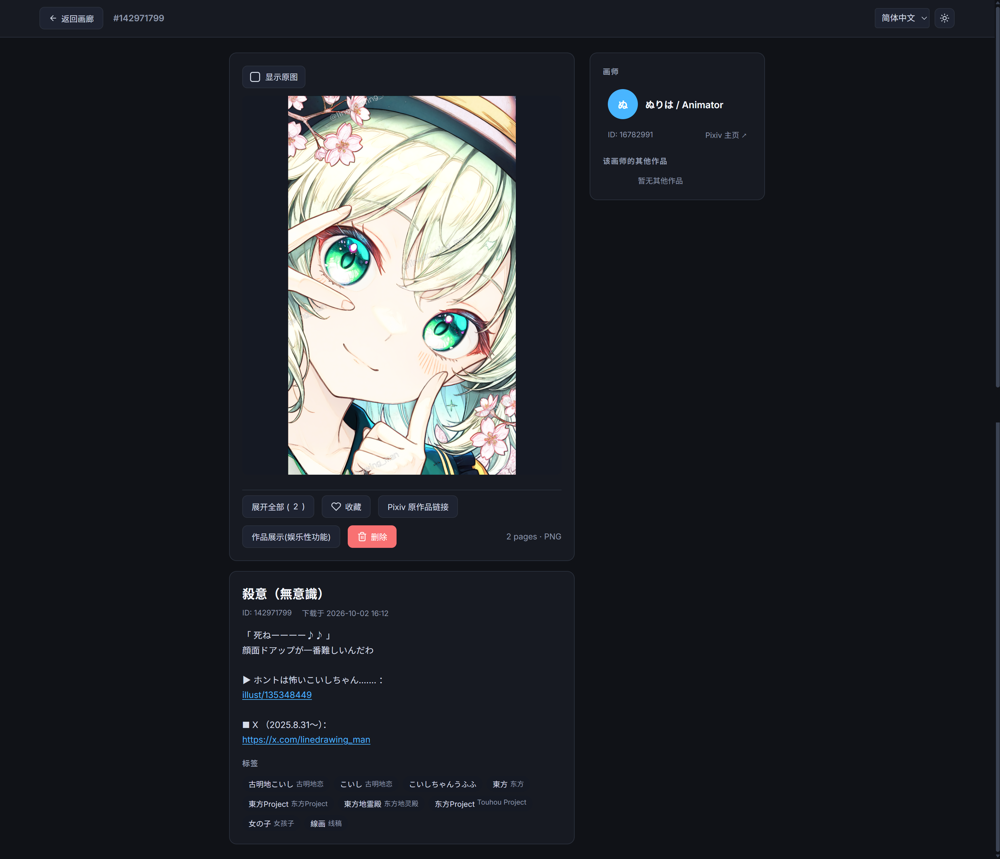
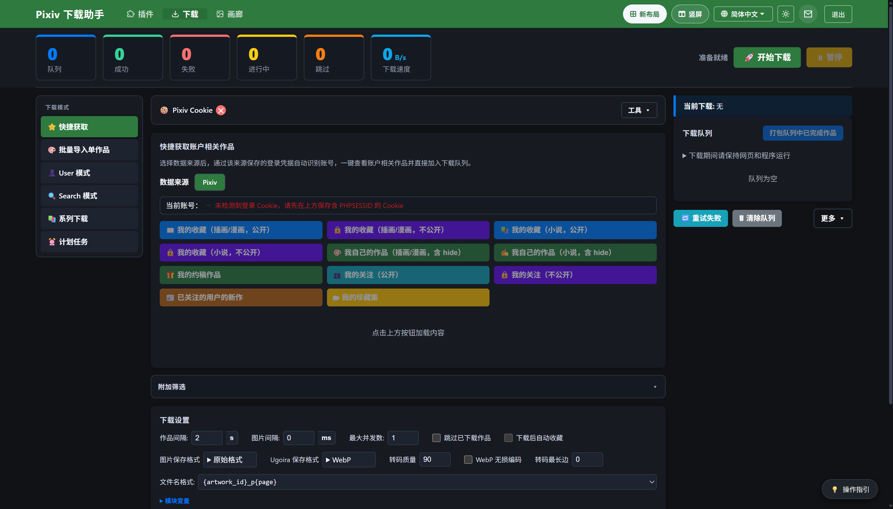

# 深色模式使用截图

应用支持简体中文界面；以下截图为简体中文版。

## Compose 桌面界面

### 首页

### 自动化

### 设置

## 下载工作台与插件

### 下载工作台：我的 Pixiv（pixiv-batch-alt.html）

### 插件管理

### 插件市场

图中启用了筛选，当前没有匹配的插件。

## 画廊

### 画廊（pixiv-gallery.html）

### 作品详情（pixiv-artwork.html）

## 经典下载布局（pixiv-batch.html）

## 油猴脚本

以下两张为 Pixiv 站内的简体中文截图，使用浅色模式。

展开浅色模式的油猴脚本截图

### Pixiv 页面批量下载器（Page Scrape）

支持 Pixiv 全站抓取。

### 单作品下载脚本（Java 后端与 Local download）

Java 后端版与 Local download 版的下载效果相同。

